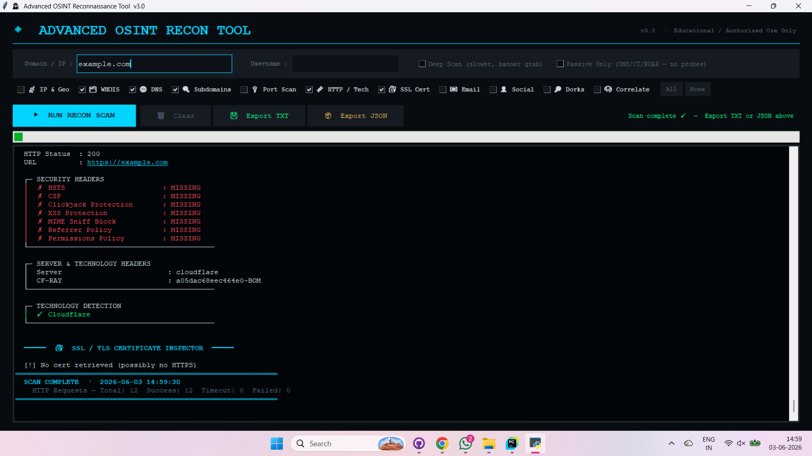
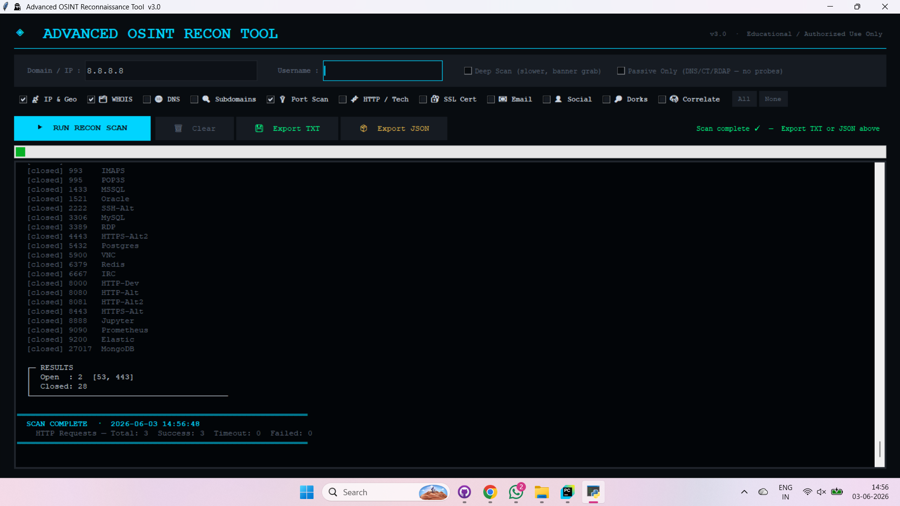
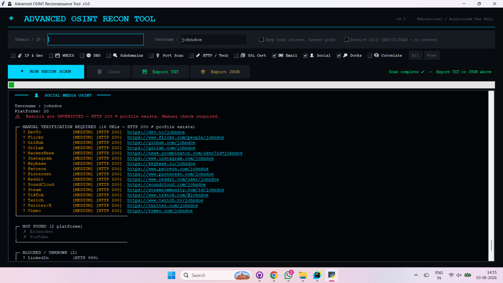

# Advanced OSINT Recon Tool

Advanced Open Source Intelligence (OSINT) reconnaissance framework designed for educational and authorized security research.

## Features

- IP & Geolocation Intelligence
- WHOIS / RDAP Analysis
- DNS Enumeration
- Subdomain Discovery
- Port Scanning
- HTTP Fingerprinting
- SSL/TLS Inspection
- Email Intelligence
- Social Media Username Analysis
- Google Dork Generation
- Correlation Engine
- Export Reports (TXT / JSON)

---

## Architecture

Input Layer

↓

Collection Layer

- IP Intelligence
- DNS Enumeration
- HTTP Fingerprinting
- SSL Inspection
- Subdomain Discovery
- Email Intelligence

↓

Processing Layer

- Confidence Scoring
- Correlation Engine
- Findings Generation

↓

Output Layer

- GUI Output
- TXT Export
- JSON Export

---

## Installation

```bash
git clone <repo-url>

cd Advanced-OSINT-Recon-Tool

pip install -r requirements.txt

python osint_recon.py
```

## Requirements

- Python 3.10+
- Internet Connection

## Usage

Launch:

```bash
python osint_recon.py
```

Enter:

- Domain / IP
- Username (optional)

Select modules.

Run scan.

Export results.

---

## Domain Recon Example



[TXT Report](screenshots/domain_report.txt)

## IP Investigation Example



[JSON Report](screenshots/ip_report.json)

## Username Investigation Example




## Educational Disclaimer

This project is intended ONLY for:

- Educational Purposes
- Authorized Security Research
- Defensive Security Testing

Do not use against systems you do not own or have permission to assess.

---

## Future Improvements

- Additional passive sources

- Improved correlation logic

- Better reporting

- ASM integration
